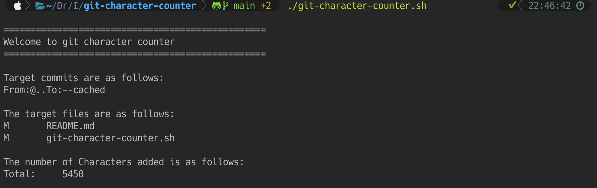

# Git Character Counter #

Git Character Counter. Calculates the number of characters or words added based on the results of Git Diff.

By measuring the number of characters added since a specific date or commit, you can use it to measure your daily writing and programming productivity.

1. [Screenshots](#screenshots)
2. [Features](#features)
3. [Requirements](#requirements)
4. [Installation](#installation)
5. [Usage](#usage)
7. [Future works (TODO)](#future-works-todo)
8. [Author](#author)
9. [Preview images](#preview-images)

## Screenshots ##



## Features ##

- The only environment required is bash and git
- Use the git diff command to count the number of characters added to the file (Binary files are excluded)
- Try to exclude blank lines, line feeds, and Front Matter
- Support for specifying n previous commits, commit hash values, and dates (date expression or ISO date)
- Support for specifying the start and end points for measurement
- Supports word count instead of character count

## Requirements ##

The only environment required is bash and git.

The development environment is as follows:

- GNU bash, version 5.1.16(1)-release (aarch64-apple-darwin21.1.0)
- git version 2.35.1

## Installation ##

Download or clone this repository.

It only needs git-character-counter.sh to work.

## Usage ##

Just run "git-character-counter.sh" in a shell.

```bash
./git-character-counter.sh
```

By default, it calculates the number of characters from the difference between the staged file and HEAD.

Note that it is a stage, not a working tree.

The reason for this is that you can choose the target of the calculation even from within the working tree. And you can also target new files by targeting a stage.

So, run this shell script after staging the file for which you want to calculate the number of characters.

```bash
$ git add .
$ ./git-character-counter.sh

=================================================
Welcome to git character counter
=================================================

Target commits are as follows:
From:@..To:--cached

The target files are as follows:
M	README.md
M	git-character-counter.sh

The number of Characters added is as follows:
Total:     1896
```

The -f (from) and -t (to) options can be used to specify the start and end points of the comparison.

The following command compares the latest commit (HEAD) with the one before it (HEAD^). In other words, it calculates the number of characters added by the latest commit.

```bash
# "-f 1" means HEAD^, "-t 0" means HEAD.

./git-character-counter.sh -f 1 -t 0
```

If a number is specified, it indicates the distance from HEAD. 0 is HEAD itself.

```bash
# "-f 3" means HEAD^^^, "-t 0" means HEAD.

./git-character-counter.sh -f 3 -t 0
```

In addition to numbers, the -f and -t options can be the commit hash and date.

Hash can be a 40-digit full hash or a 7-digit abbreviated hash.

```bash
# All of the following commands will have the same result.

./git-character-counter.sh -f 48b5460a426cf2beffd6d71f089d9c3278b4f705 -t 196ff5bdabaf10afdeb40f7623e0cc09eea1d7a5
./git-character-counter.sh -f 48b5460 -t 196ff5b
./git-character-counter.sh -f 48b5460a426cf2beffd6d71f089d9c3278b4f705 -t 196ff5b
```

The date can be date expression or ISO date.

```bash
# The following is an example of specifying a date expression.
# The following command will give you the number of characters added yesterday (If it contains whitespace, enclose it in ").

./git-character-counter.sh -f "2 days ago" -t yesterday

# The following command will give you the number of characters added today (If -t is omitted, staged files will be targeted).

./git-character-counter.sh -f yesterday

# In the following example, we get the number of characters added from yesterday to the latest commit (Staged files are not included).

./git-character-counter.sh -f yesterday -t 0

# ISO date can be used to specify a specific date.

./git-character-counter.sh -f 2022-02-05 -t 2022-02-06

# With ISO date, you can also specify the time (In this case, enclose it in ").

./git-character-counter.sh -f "2022-02-06 0:00" -t "2022-02-06 23:59"
```

However, since date is an ambiguous concept in Git, we recommend specifying hash to get reliable results.

-w option can be used to calculate the number of words instead of the number of characters. Note, however, that languages such as Japanese will not calculate the word count correctly.

```bash
./git-character-counter.sh -w
```

For example, if you put the following in the pre-commit hook of Git Hooks(.git/hooks/pre-commit), you can run this program only on the files that have changed.

```bash:.git/hooks/pre-commit
bash /foo/bar/git-character-counter.sh
```

## Future works (TODO) ##

- Improvement of front matter support
- Output the details for each file
- Number of characters and words in the whole document
- Ignore tags in markdown notation

## Author ##

- [jMatsuzaki](https://jmatsuzaki.com/)
- [jMatsuzaki Inc.](https://jmatsuzaki.com/company)
- [@jmatsuzaki](https://twitter.com/jmatsuzaki)

## Preview images ##

Preview images were taken using:

- [iTerm2](https://iterm2.com/) terminal emulator on macOS
